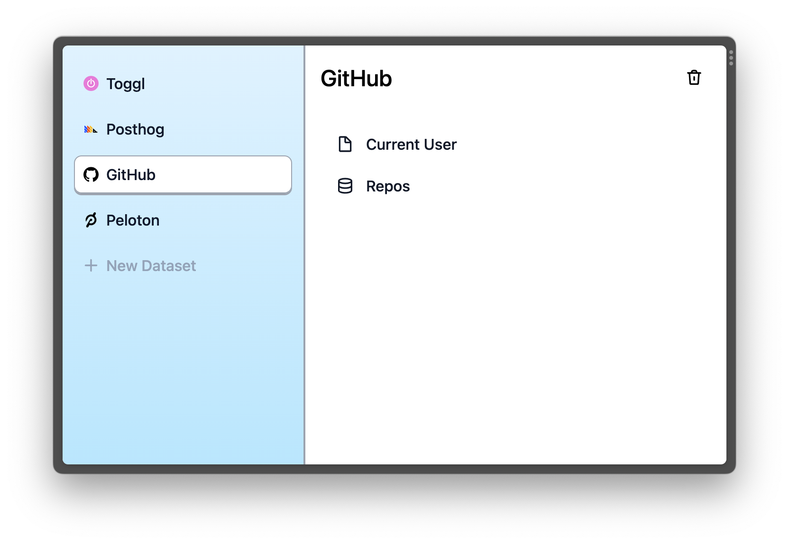

# Mainframe

Mainframe is a database to sync data from third-party services.



## Get started

#### Setup

Run these commands to get started with Mainframe:

```sh
npm create mainframe
cd mainframe
yarn start
```

Then, to open the dashboard, navigate to <http://localhost:8744>

## License

MIT
