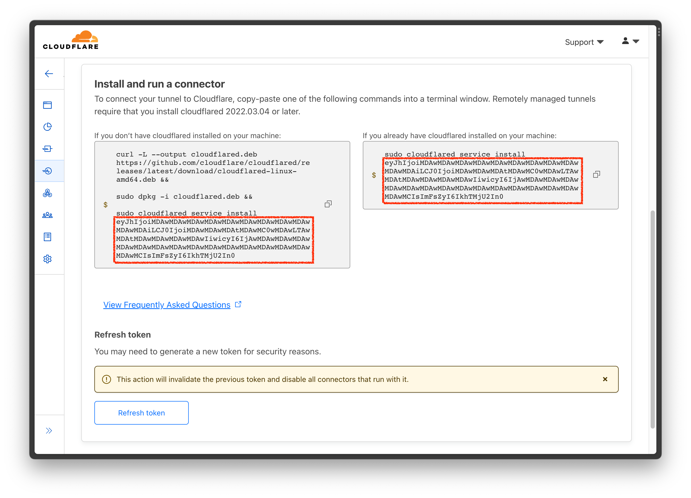

# Remote access with Cloudflare Tunnels

If you want live data updates through webhooks, or access your instance outside of your home network, you'll want to configure HTTP tunneling to expose your Mainframe instance to the internet.

Cloudflare tunnel is a great option to achieve that, and Mainframe is setup to handle the connection for you, given that the tunnel token is provided.

This tutorial is based on [Cloudflare's official docs](https://developers.cloudflare.com/cloudflare-one/connections/connect-networks/get-started/create-remote-tunnel/), adapted to include Mainframe specifics.

## Prerequisites

Before you start, make sure you:

-   [Add a website to Cloudflare](https://developers.cloudflare.com/fundamentals/setup/account-setup/add-site/).
-   [Change your domain nameservers to Cloudflare](https://developers.cloudflare.com/dns/zone-setups/full-setup/setup/).

## 1. Create a tunnel

1. Log in to [Zero Trust](https://one.dash.cloudflare.com) and go to **Access** > **Tunnels**.

2. Select **Create a tunnel**.

3. Enter a name for your tunnel. We suggest choosing a name that reflects the type of resources you want to connect through this tunnel (for example, `mainframe`).

4. Select **Save tunnel**.

5. Copy the token displayed in the **Install and run a connector** section, displayed after `sudo cloudflared service install `. Here's a highlighted screenshot:

    

(The tokens in the image are fake)

6. Open the `.env` file on the root of your Mainframe folder and add new lines for your Cloudflare token, and your base URL:

```bash
COOKIE_SECRET=...
# Add these lines:
CLOUDFLARED_TOKEN=eyJhIjoiMDAwM...DAwMCIsImFsZyI6IkhTMjU2In0
TUNNEL_BASE_API_URL=https://example.com
```

7. Select **Next**.

## 2. Configure the tunnel

Follow these steps to connect an application through your tunnel. If you are looking to connect a network, skip to the [Connect a network section](#3-connect-a-network).

1. In the **Public Hostnames** tab, choose an application from the drop-down menu and specify any subdomain or path information.

2. Specify your local Mainframe URL, default is `https://localhost:8744`.

3. Select **Save `<tunnel-name>`**.

## 3. Test your tunnel

After saving the tunnel, you will be redirected to the **Tunnels** page. Look for your new tunnel to be listed along with its active connector.

Restart your Mainframe instance, kill the process and run `yarn start` on the root of your Mainframe folder.

Open your custom domain on a browser to see your Mainframe!
