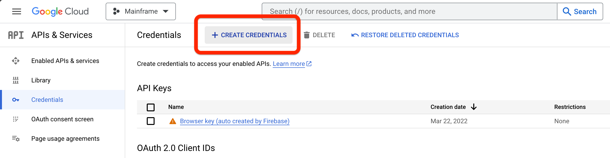

# Google

Based on the [Official Google API guide](https://developers.google.com/calendar/api/guides/overview)

-   [ ] Create a Google Cloud Project: [Guide](https://developers.google.com/workspace/guides/create-project) • [Console](https://console.cloud.google.com/projectcreate)
-   [ ] Enable APIs: [Guide](https://developers.google.com/workspace/guides/enable-apis) • [Console](https://console.cloud.google.com/workspace-api/products)
    -   [Google Calendar](https://console.cloud.google.com/apis/library/calendar-json.googleapis.com)
-   [ ] Configure OAuth Consent: [Guide](https://developers.google.com/workspace/guides/configure-oauth-consent) • [Console](https://console.cloud.google.com/apis/credentials/consent)
-   [ ] Create OAuth credentials: [Guide](https://developers.google.com/workspace/guides/create-credentials#oauth-client-id) • [Console](https://console.cloud.google.com/apis/credentials)
    1. Navigate to [Credentials](https://console.cloud.google.com/apis/credentials)
    2. Click on "Create Credentials"
       
    3. Set the callback URL. You can either find it on your dataset page where you set your client ID and client secret, or you can use `http://localhost:8744/oauth/callback/{DATASET_ID}`
    4. Copy your client ID and client secret to your Dataset page
    5. Save your credentials on Mainframe and on the Google Cloud Dashboard
